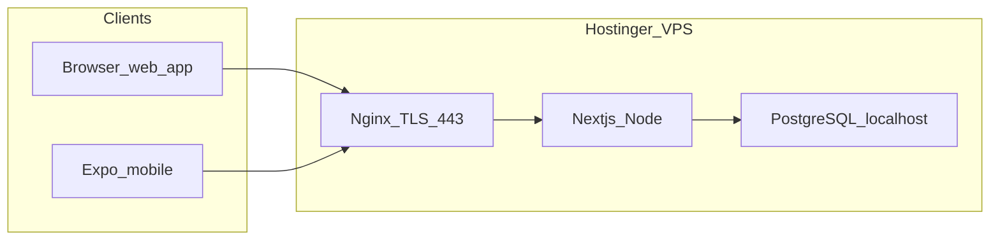

# Fleet Flows — Product Requirements Document (PRD)

**Version:** 1.0  
**Last updated:** 2026-04-12  
**Stack reference:** Next.js 16, React 19, Prisma, PostgreSQL, NextAuth (Auth.js v5), Expo (mobile).

---

## 1. Vision

Fleet Flows is a **multi-tenant employee transport and fleet operations** product. Organizations (tenants) manage vehicles, drivers, employees, shifts, and trips; **super admins** operate cross-tenant tooling; **drivers** and **employees** use lightweight mobile flows for daily trip execution.

**Success looks like:** a tenant transport manager can plan and monitor runs, drivers complete trips with correct passenger state, and leadership can audit activity without manual spreadsheets.

---

## 2. Personas

| Persona | Needs (day-one) |
|--------|------------------|
| **Super admin** | Create/suspend tenants, impersonate/support, system-wide analytics and audit visibility. |
| **Tenant admin** | Full control within one company: users, billing views, settings. |
| **Tenant manager** | Day-to-day: employees, drivers, vehicles, shifts, trips, alerts, live map, exports. |
| **Driver** | See today’s trips, start/complete legs, minimal friction on phone. |
| **Employee** | See relevant trip, mark board / no-show. |

---

## 3. Scope

### 3.1 v1 (MVP on Hostinger VPS)

- Web app: manager **dashboard**, **login**, core modules (home, trips, employees, drivers, vehicles, shifts, alerts, live map, analytics, settings, billing page surfaces as implemented).
- Web app: **super-admin** area (`/admin/*`): companies, users, billing, analytics, audit, monitoring (UI may mix real APIs and placeholder metrics — see risks).
- **REST APIs** under `src/app/api/*` including **mobile v1** (`/api/mobile/v1/*`).
- **PostgreSQL** on the same VPS as the app (all-in-one topology).
- **TLS** (HTTPS) on a real domain; **no** hardcoded server IPs in mobile clients.
- **Auth:** bcrypt-backed **User** (admin/manager/super_admin); **Driver** and **Employee** use optional `loginPinHash` (bcrypt). Legacy demo PINs are **disabled in production** unless `ALLOW_DEMO_DRIVER_EMPLOYEE_AUTH=true` (staging only).

### 3.2 Later / backlog

- Native app store releases (TestFlight / Play Internal testing → production).
- Stripe-backed **automatic** billing (UI exists; scope TBD when you confirm payments).
- Real monitoring tied to metrics (Prometheus/Grafana, hosted APM), not static demo cards.
- CI gates (e2e), rate limiting, advanced password reset and lockout policies.
- Read replicas or **managed PostgreSQL** if single-node limits are hit.

### 3.3 Out of scope (v1)

- Guaranteed SLA or 24/7 NOC (unless you contract operations separately).
- Physical GPS hardware integration beyond maps configuration.

---

## 4. Functional requirements (mapped to codebase)

### 4.1 Authentication and sessions

- **Web:** Credentials provider; roles persisted in JWT session (`src/lib/auth.ts`, `src/lib/auth.config.ts`). Session pages: `/login`, driver login under `(mobile)/driver/login`.
- **Mobile API:** `POST /api/mobile/v1/auth/login` returns JWT; subsequent calls use `Authorization: Bearer`.
- **Production:** `AUTH_SECRET` required; mobile JWT must not use a hardcoded fallback (`src/lib/auth-secret.ts`).

### 4.2 Tenant isolation

- Prisma models carry `tenantId`; APIs and UI must scope reads/writes by the authenticated user’s tenant (super_admin exceptions as implemented).

### 4.3 Operational entities

- **Employees:** CRUD, bulk CSV (`/api/employees`, bulk route), pickup metadata, status.
- **Drivers:** CRUD, license, phone, status, trips assignment.
- **Vehicles:** CRUD, capacity, type, plate uniqueness.
- **Trips:** listing, manual creation, generation (`/api/trips`, manual, generate), statuses per `TripStatus` enum.
- **Shifts:** named windows per tenant.
- **Invoices / billing:** models and API routes exist; treat financial automation as backlog unless Stripe is confirmed for v1.

### 4.4 Mobile (Expo)

- Role selection login → driver or employee home.
- Driver: `GET /api/mobile/v1/trips/daily`, `POST /api/mobile/v1/trips/[id]/action`.
- Employee: same daily endpoint, `POST /api/mobile/v1/passengers/[id]/action`.
- **Configuration:** `EXPO_PUBLIC_API_URL` must point to the deployed API root including `/api` (e.g. `https://your-domain.com/api`).

### 4.5 Admin and compliance

- Audit log model and admin audit UI.
- Impersonation API exists (`/api/admin/impersonate`) — restrict to super_admin in production reviews.

---

## 5. Non-functional requirements

| ID | Requirement | Target / note |
|----|-------------|----------------|
| NFR-1 | **Transport security** | HTTPS everywhere; HSTS on Nginx after validation. |
| NFR-2 | **Secrets** | No secrets in git; `.env*` ignored; bootstrap passwords only via env for seed. |
| NFR-3 | **Database** | Migrations applied with `prisma migrate deploy` on each release. |
| NFR-4 | **Availability** | Single-node VPS — document RTO/RPO expectations (e.g. nightly `pg_dump` + Hostinger snapshots). |
| NFR-5 | **Observability** | Nginx + app logs; optional Sentry later. |
| NFR-6 | **Demo auth** | Production must not rely on PIN `1234` or license-as-password unless explicit staging flag is set. |

---

## 6. Data model (summary)

See [prisma/schema.prisma](../prisma/schema.prisma): `Tenant`, `User`, `Employee`, `Driver`, `Vehicle`, `Trip`, `TripPassenger`, `Shift`, `Invoice`, `AuditLog`.  
**v1 addition:** optional `loginPinHash` on `Driver` and `Employee` for bcrypt PIN/password storage.

---

## 7. Integrations

- **Google Maps:** `GOOGLE_MAPS_API_KEY` for live map (see [DEPLOYMENT.md](../DEPLOYMENT.md)).
- **Stripe:** optional; confirm before adding webhook and payment state to v1 acceptance tests.

---

## 8. VPS architecture (Hostinger all-in-one)

- **Firewall:** allow `22` (SSH), `80` (ACME), `443` (HTTPS) only where possible.
- **Process:** `next start` on `127.0.0.1:3000` behind Nginx reverse proxy.

**Implementation detail:** follow [VPS-DEPLOYMENT.md](../VPS-DEPLOYMENT.md) and [scripts/vps/README.md](../scripts/vps/README.md).

---

## 9. Environments and configuration

| Variable | Required (prod) | Purpose |
|----------|-------------------|---------|
| `DATABASE_URL` | Yes | PostgreSQL connection string. |
| `AUTH_SECRET` | Yes | NextAuth + mobile JWT signing. |
| `AUTH_URL` or `NEXTAUTH_URL` | Yes | Canonical public URL of the app (https). |
| `GOOGLE_MAPS_API_KEY` | For maps | Live map tiles / JS API as used by the app. |
| `ALLOW_DEMO_DRIVER_EMPLOYEE_AUTH` | No (default off in prod) | If `true`, allows legacy demo driver/employee PIN rules when `loginPinHash` is unset — **staging only**. |
| `SEED_SUPER_ADMIN_PASSWORD` | When running seed | One-time bootstrap password for super admin (never commit). |
| `EXPO_PUBLIC_API_URL` | For mobile builds | e.g. `https://your-domain.com/api` |

---

## 10. Acceptance criteria and smoke tests

Executable checklist: [SMOKE_TESTS.md](./SMOKE_TESTS.md).

**Minimum v1 go-live:**

1. HTTPS loads login page; invalid login fails; valid **User** login reaches dashboard.
2. `prisma migrate deploy` succeeds against production DB.
3. Mobile app built with `EXPO_PUBLIC_API_URL` can log in (driver/employee with `loginPinHash` set, or staging with demo flag per policy) and load daily trips.
4. Create employee → appears in list; create trip including that employee → appears for employee mobile flow where applicable.
5. Super admin seed completed only via controlled process; password rotated after first login.

---

## 11. Risks and open questions

| Risk | Mitigation |
|------|------------|
| Single VPS = single point of failure | Snapshots + off-VPS backups; later move DB to managed service. |
| Monitoring page shows illustrative metrics | Replace with real telemetry when NFR demands it. |
| Stripe / payments scope unclear | Confirm before PRD v1.1; keep billing UI as reporting-only until then. |
| Domain/DNS not finalized | Use temporary hostname only for smoke tests; switch `AUTH_URL` when domain is live. |

---

## 12. PRD review and edits (for you)

Use this section to record decisions as you edit the PRD:

- [ ] **Domain:** `________________________`
- [ ] **Stripe in v1?** Yes / No / Later: `___`
- [ ] **Staging hostname** (optional): `________________________`
- [ ] **Notes / scope changes:**

_Date reviewed: ___________   Reviewer: ___________
